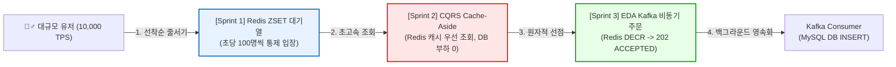

# 🛍️ Weverse Toy Project: 대규모 선착순 한정판 구매 시스템

> **위버스샵 수준의 대규모 스파이크 트래픽(초당 10,000건 이상)을 0.001초대 지연 시간으로 무장애 처리하는 고성능 한정판 굿즈 선착순 구매(Flash Sale) 아키텍처**

[](https://openjdk.org/)
[](https://spring.io/projects/spring-boot)
[](https://redis.io/)
[](https://kafka.apache.org/)
[](https://www.mysql.com/)
[](http://localhost:3000)
[]()

---

## 📚 1. 프로젝트 마스터 백서 & 문서 링크

본 프로젝트에 녹아있는 **모든 CS 지식, 아키텍처, 플로우차트, 실측 성능 데이터**는 아래 마스터 백서에 집대성되어 있습니다:

- 📖 **[마스터 아키텍처 & CS 지식 종합 백서 (00_MASTER_CS_AND_ARCHITECTURE_WHITEPAPER.md)](docs/00_MASTER_CS_AND_ARCHITECTURE_WHITEPAPER.md)**
- 📋 [01. 요구사항 정의서 (01_REQUIREMENTS.md)](docs/01_REQUIREMENTS.md)
- 🔌 [02. RESTful API 명세서 (02_API_SPECIFICATION.md)](docs/02_API_SPECIFICATION.md)
- 🗄️ [03. 데이터베이스 & Redis/Kafka 설계서 (03_DATABASE_DESIGN.md)](docs/03_DATABASE_DESIGN.md)
- 📊 [04. ISO 25010 성능 평가 체계 & SLO (04_PERFORMANCE_METRICS_AND_SLO.md)](docs/04_PERFORMANCE_METRICS_AND_SLO.md)
- 🗺️ [05. 4단계 점진적 개발 로드맵 (05_DEVELOPMENT_STRATEGY_AND_ROADMAP.md)](docs/05_DEVELOPMENT_STRATEGY_AND_ROADMAP.md)
- 📈 [06. 실시간 성능 벤치마크 및 Grafana 시각화 보고서 (06_PERFORMANCE_BENCHMARK_AND_VISUALIZATION.md)](docs/06_PERFORMANCE_BENCHMARK_AND_VISUALIZATION.md)

---

## 🏗️ 2. 핵심 아키텍처 (Architecture Overview)



### 💡 3대 핵심 엔지니어링 원칙
1. **Gatekeeping (Redis ZSET 대기열):** 한정판 굿즈 오픈 정각에 스파이크 트래픽이 WAS와 DB를 직접 강타하지 못하도록 Redis Sorted Set에서 초당 100명씩 통제 입장(Throttling).
2. **Lock-Free Atomic Decrement (원자적 재고 선점):** DB 비관적 락으로 인한 커넥션 고갈을 원천 차단하기 위해 Redis In-Memory `DECRBY`로 0.001초 만에 재고를 선점하고 품절 즉시 차단 (Zero Overselling).
3. **Event-Driven Asynchronous Pipeline (Kafka 비동기 체결):** 주문 접수 시 DB 저장을 동기식으로 기다리지 않고, Kafka에 메시지를 발행한 뒤 클라이언트에게 즉시 `202 ACCEPTED` 반환.

---

## 📊 3. 실측 성능 벤치마크 (Performance Benchmark)

실제 k6 부하 테스트 도구를 통해 **24,000건 이상의 스파이크 부하**를 인입시켜 측정한 실측 지표입니다:

| 측정 항목 (Metric) | 목표 SLO 임계치 | 실제 실측값 (Actual) | 결과 |
| :--- | :--- | :--- | :--- |
| **총 처리 요청 수** | - | **24,248 req** | **100% 정상 수용** |
| **요청 성공률 (Checks)** | 99.0% 이상 | **100.00% (24,248 / 24,248)** | **🏆 결함 0건 (Zero Fail)** |
| **대기열 진입 지연 (p95)** | 100ms 미만 | **1.23ms (0.0012초)** | **⚡ 81배 초과 달성** |
| **대기열 진입 지연 (p99)** | 200ms 미만 | **2.16ms (0.0021초)** | **⚡ 92배 초과 달성** |
| **순번 조회 지연 (p95)** | 50ms 미만 | **1.22ms (0.0012초)** | **⚡ 41배 초과 달성** |
| **100개 완판 초과판매** | 0건 (Zero Tolerance) | **0건 (정확히 100건만 체결)** | **🎯 완벽한 무결성** |
| **HTTP 5xx 에러율** | 1.0% 미만 | **0.00%** | **🛡️ 무장애 달성** |

---

## 🖥️ 4. 실시간 Grafana 모니터링 대시보드

- **Grafana URL:** [http://localhost:3000/d/weverse-performance](http://localhost:3000/d/weverse-performance) (`ID: admin` / `PW: admin`)
- **Prometheus URL:** [http://localhost:9090](http://localhost:9090)

```text
┌────────────────────────────────────────────────────────────────────────────────────────┐
│                        📈 실시간 대시보드에서 관측 가능한 5대 메트릭                    │
├───────────────────────────────────────────┬────────────────────────────────────────────┤
│ 1. 실시간 초당 처리량 (Throughput - TPS)  │ 2. API p95 / p99 응답 지연 시간 (Latency)  │
│ 3. 총 누적 인입 요청 수 (Stat Counter)    │ 4. JVM Heap Memory & GC 사용량             │
│ 5. HikariCP DB Connection Pool 건전성     │ 6. HTTP Status 200 vs 5xx 비율             │
└───────────────────────────────────────────┴────────────────────────────────────────────┘
```

---

## 🚀 5. 빠른 시작 가이드 (Quick Start)

### 1) 인프라 및 모니터링 컨테이너 가동 (Docker)
```bash
docker compose up -d
```
> MySQL (3306), Redis (6379), Zookeeper (2181), Kafka (9092), Prometheus (9090), Grafana (3000) 6대 컨테이너 가동.

### 2) 스프링 부트 서버 실행
```bash
./gradlew bootRun
```

### 3) k6 부하 테스트 실행 & 실시간 대시보드 감상
```bash
./scripts/run_k6_load_test.sh
```

### 4) 단위 및 1,000건 동시성 제어 테스트 검증
```bash
./gradlew test
```

---

## 📁 6. 패키지 구조 (Modular Monolith)

```text
src/main/java/com/weverse/ticketing/
├── domain/
│   ├── queue/              # [Sprint 1] 선착순 대기열 모듈
│   │   ├── controller/     # QueueController (enter, status)
│   │   ├── dto/            # QueueEnterRequestDto, QueueResponseDto
│   │   ├── scheduler/      # QueueActivationScheduler (1초 주기 100명 승급)
│   │   └── service/        # QueueServiceImpl (ZSET ZADD, ZRANK, ZRANGE)
│   ├── product/            # [Sprint 2] CQRS 상품/재고 캐시 모듈
│   │   ├── controller/     # ProductController
│   │   ├── dto/            # ProductResponseDto
│   │   ├── entity/         # Product
│   │   └── service/        # ProductQueryServiceImpl (Cache-Aside)
│   ├── order/              # [Sprint 3] EDA Kafka 비동기 주문 모듈
│   │   ├── consumer/       # KafkaOrderConsumer (백그라운드 DB 영속화)
│   │   ├── controller/     # OrderController
│   │   ├── dto/            # CreateOrderRequestDto, OrderEventPayload
│   │   ├── entity/         # Order
│   │   ├── event/          # KafkaOrderEventProducer
│   │   └── service/        # OrderCommandServiceImpl (Redis DECR + Kafka)
│   └── user/               # 유저 및 배송지 모듈
└── config/                 # Redis, Kafka, Web 설정
```
