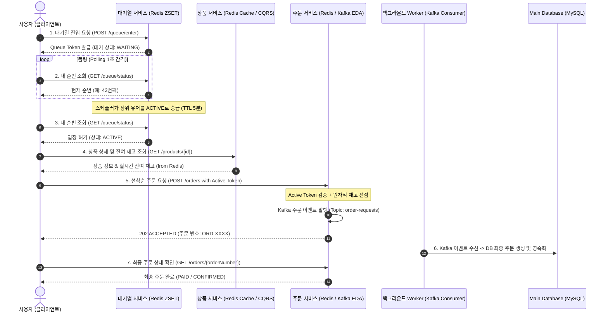

# 01. 대규모 선착순 예매 시스템 요구사항 정의 및 분석서

## 1. 프로젝트 개요 & 비즈니스 목표
- **시스템 명칭:** 위버스(Weverse) 스타일 대규모 트래픽 한정판 굿즈 선착순 예매 시스템
- **비즈니스 목표:** 
  - 인기 아티스트의 한정판 굿즈(수량 100개 한정 등) 오픈 시점의 폭발적인 트래픽 스파이크(초당 1,000~10,000건)를 안정적으로 수용.
  - 시스템 다운(HikariCP 고갈, DB 과부하) 없이 선착순 순번 공정성을 보장하고, **초과 판매(Overselling) Zero**를 달성.

---

## 2. 기능적 요구사항 (Functional Requirements)

### [FR-01] 대기열(Waiting Queue) 진입 및 토큰 발급
- 유저는 특정 상품 오픈 전/후 대기열에 진입할 수 있다.
- 진입 시 고유 대기열 토큰(UUID 기반 Queue Token)을 발급받는다.
- 진입 시간(Epoch Millisecond)을 기준으로 공정한 FIFO 순번이 부여된다.

### [FR-02] 실시간 대기 순번 및 상태 폴링 (Polling)
- 유저는 자신의 대기 토큰을 통해 현재 내 앞 대기자 수와 상태(`WAITING`, `ACTIVE`, `EXPIRED`)를 주기적으로 조회한다.
- 예상 대기 시간과 현재 진입 가능 여부를 실시간으로 확인한다.

### [FR-03] 작업열(Active/Pass Queue) 승급 및 입장 권한 검증
- 백엔드 스케줄러는 백엔드 DB와 서버 처리 용량(예: 초당 50~100명)에 맞추어 대기열 상위 인원을 '입장 허용(ACTIVE)' 상태로 승급한다.
- 활성 토큰은 보안 검증을 거치며, 유효시간(TTL 5분) 내에 주문 페이지 진입 및 결제/주문을 완료해야 한다. 만료 시 재진입해야 한다.

### [FR-04] 상품 상세 및 실시간 잔여 재고 조회 (CQRS Read)
- 유저는 상품 정보(가격, 설명, 판매 기간) 및 현재 실시간 구매 가능한 잔여 재고를 조회한다.
- 대규모 조회 트래픽은 RDBMS를 거치지 않고 In-Memory 캐시(Redis)를 통해 밀리초 단위로 응답한다.

### [FR-05] 선착순 주문 접수 (비동기 EDA 처리)
- 작업열을 통과한 유효한 토큰을 가진 유저만 주문 요청을 보낼 수 있다.
- 동일 유저의 중복 주문(1인 1구매 제한 등)을 방지한다.
- 주문 요청 시 RDB에 동기 INSERT를 하지 않고 비동기 이벤트(Kafka)로 접수하며, 유저에게는 `202 ACCEPTED`와 주문 번호를 즉시 반환한다.
- 수량 선점은 분산 환경에서 원자적(Atomic)으로 이루어져 100개 이상의 초과 예약이 발생하지 않는다.

### [FR-06] 비동기 주문 체결 및 결과 조회
- 백그라운드 Consumer가 Kafka 이벤트를 순차 소비하여 RDB에 최종 주문서 생성 및 결제 처리를 수행한다.
- 유저는 주문 번호(`orderNumber`)로 주문 최종 성공/실패 상태를 조회할 수 있다.

---

## 3. 비기능적 요구사항 (Non-Functional Requirements)

| 항목 | 목표치 | 검증 방안 |
| :--- | :--- | :--- |
| **Throughput (처리량)** | 피크 시 초당 1,000 TPS 이상 인입 수용 | k6 / nGrinder 부하 테스트 |
| **Response Latency** | 대기 순번 조회 p99 < 50ms, 주문 접수 p99 < 150ms | APM / Actuator Metrics |
| **Data Integrity (정합성)** | 재고 초과 판매 0건 (Zero Tolerance), 100개 정확히 매진 | 동시성 1,000건 멀티스레드 통합 테스트 |
| **High Availability (가용성)** | DB 커넥션 풀 고갈 방지, 99.9% 요청 정상 수용 | 모듈러 모놀리스 및 버퍼링 구조 |
| **Security & Fairness** | 대기열 우회 차단 (유효 토큰 헤더 검증), 매크로/어뷰징 방지 | Interceptor / Filter 기반 토큰 검증 |

---

## 4. End-to-End 유저 시퀀스 흐름

