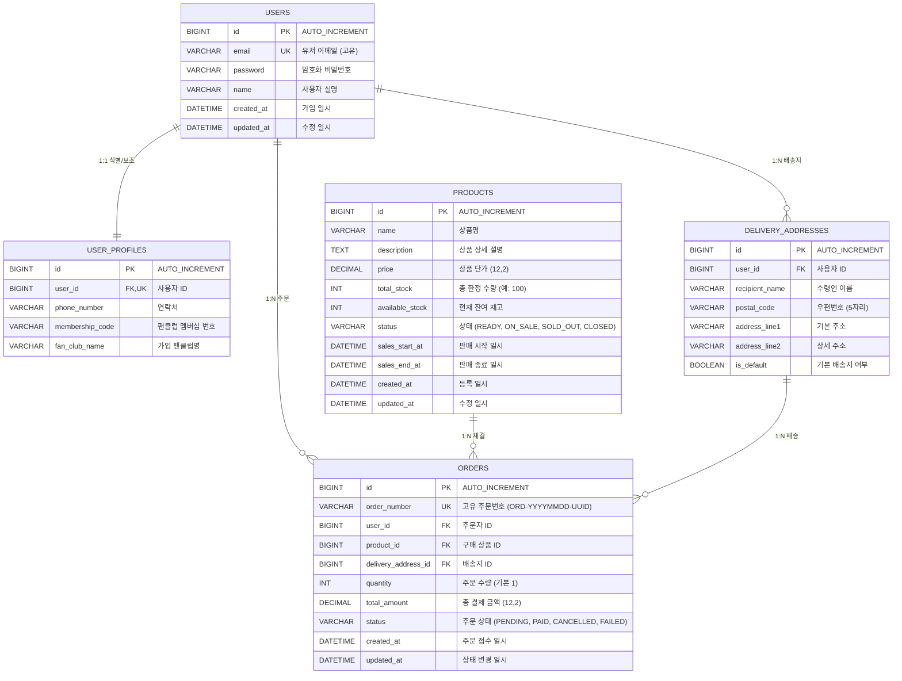

# 03. 데이터베이스 및 인메모리(Redis) 저장소 설계서

위버스 선착순 구매 시스템의 **CQRS & EDA 분리 원칙**에 따라, 영속성 계층인 RDBMS(MySQL)와 고성능 인메모리 계층인 Redis의 스키마 및 저장 구조를 설계합니다.

---

## 1. RDBMS (MySQL 8) 스키마 설계

### 1.1. ERD (Entity Relationship Diagram)



---

### 1.2. 테이블별 DDL 및 인덱스 전략

```sql
-- 1. 사용자 테이블
CREATE TABLE users (
    id BIGINT AUTO_INCREMENT PRIMARY KEY,
    email VARCHAR(100) NOT NULL UNIQUE,
    password VARCHAR(200) NOT NULL,
    name VARCHAR(50) NOT NULL,
    created_at DATETIME(6) NOT NULL DEFAULT CURRENT_TIMESTAMP(6),
    updated_at DATETIME(6) NOT NULL DEFAULT CURRENT_TIMESTAMP(6) ON UPDATE CURRENT_TIMESTAMP(6)
) ENGINE=InnoDB DEFAULT CHARSET=utf8mb4 COLLATE=utf8mb4_unicode_ci;

-- 2. 사용자 프로필 테이블 (1:1 LAZY)
CREATE TABLE user_profiles (
    id BIGINT AUTO_INCREMENT PRIMARY KEY,
    user_id BIGINT NOT NULL UNIQUE,
    phone_number VARCHAR(20),
    membership_code VARCHAR(50),
    fan_club_name VARCHAR(100),
    CONSTRAINT fk_user_profiles_user FOREIGN KEY (user_id) REFERENCES users(id) ON DELETE CASCADE
) ENGINE=InnoDB DEFAULT CHARSET=utf8mb4 COLLATE=utf8mb4_unicode_ci;

-- 3. 배송지 테이블
CREATE TABLE delivery_addresses (
    id BIGINT AUTO_INCREMENT PRIMARY KEY,
    user_id BIGINT NOT NULL,
    recipient_name VARCHAR(50) NOT NULL,
    postal_code VARCHAR(10) NOT NULL,
    address_line1 VARCHAR(255) NOT NULL,
    address_line2 VARCHAR(255),
    is_default BOOLEAN NOT NULL DEFAULT FALSE,
    INDEX idx_delivery_addresses_user_id (user_id),
    CONSTRAINT fk_delivery_addresses_user FOREIGN KEY (user_id) REFERENCES users(id) ON DELETE CASCADE
) ENGINE=InnoDB DEFAULT CHARSET=utf8mb4 COLLATE=utf8mb4_unicode_ci;

-- 4. 상품 테이블
CREATE TABLE products (
    id BIGINT AUTO_INCREMENT PRIMARY KEY,
    name VARCHAR(150) NOT NULL,
    description TEXT,
    price DECIMAL(12, 2) NOT NULL,
    total_stock INT NOT NULL,
    available_stock INT NOT NULL,
    status VARCHAR(20) NOT NULL DEFAULT 'READY',
    sales_start_at DATETIME NOT NULL,
    sales_end_at DATETIME NOT NULL,
    created_at DATETIME(6) NOT NULL DEFAULT CURRENT_TIMESTAMP(6),
    updated_at DATETIME(6) NOT NULL DEFAULT CURRENT_TIMESTAMP(6) ON UPDATE CURRENT_TIMESTAMP(6),
    INDEX idx_products_status_sales_time (status, sales_start_at, sales_end_at)
) ENGINE=InnoDB DEFAULT CHARSET=utf8mb4 COLLATE=utf8mb4_unicode_ci;

-- 5. 주문 테이블
CREATE TABLE orders (
    id BIGINT AUTO_INCREMENT PRIMARY KEY,
    order_number VARCHAR(64) NOT NULL UNIQUE,
    user_id BIGINT NOT NULL,
    product_id BIGINT NOT NULL,
    delivery_address_id BIGINT NOT NULL,
    quantity INT NOT NULL,
    total_amount DECIMAL(12, 2) NOT NULL,
    status VARCHAR(30) NOT NULL DEFAULT 'PENDING',
    created_at DATETIME(6) NOT NULL DEFAULT CURRENT_TIMESTAMP(6),
    updated_at DATETIME(6) NOT NULL DEFAULT CURRENT_TIMESTAMP(6) ON UPDATE CURRENT_TIMESTAMP(6),
    INDEX idx_orders_user_created_at (user_id, created_at DESC),
    INDEX idx_orders_product_status (product_id, status),
    CONSTRAINT fk_orders_user FOREIGN KEY (user_id) REFERENCES users(id),
    CONSTRAINT fk_orders_product FOREIGN KEY (product_id) REFERENCES products(id),
    CONSTRAINT fk_orders_delivery_address FOREIGN KEY (delivery_address_id) REFERENCES delivery_addresses(id)
) ENGINE=InnoDB DEFAULT CHARSET=utf8mb4 COLLATE=utf8mb4_unicode_ci;
```

---

## 2. Redis 인메모리 데이터 구조 설계 (대기열 & CQRS 캐시)

대규모 트래픽을 완충하기 위해 Redis에 저장하는 데이터의 Key 구조와 TTL, 자료구조를 명확히 규정합니다.

| 용도 | Redis Key 패턴 | 자료구조 | Score / Value 명세 | TTL |
| :--- | :--- | :--- | :--- | :--- |
| **대기열 (Waiting Queue)** | `queue:product:{productId}:waiting` | **Sorted Set (ZSET)** | **Member:** `{token}`<br>**Score:** 진입 Unix Epoch 타임스탬프 (ms) | 자동 만료 없음 (스케줄러가 소비 후 제거) |
| **작업열 (Active Token)** | `queue:token:active:{token}` | **String (Key-Value)** | **Value:** JSON `{"userId": 1001, "productId": 1, "status": "ACTIVE"}` | **5분 (300초)** |
| **상품 캐시 (CQRS Read)** | `product:detail:{productId}` | **String (JSON)** | **Value:** `ProductResponseDto` JSON 문자열 | **10분 (600초)** |
| **실시간 잔여 재고 (Atomic Counter)** | `product:stock:{productId}` | **Integer (String)** | **Value:** 남은 재고 수량 (예: `"100"`) | 이벤트 종료 시까지 |
| **유저 1인 1구매 중복 방지** | `product:{productId}:ordered:user:{userId}` | **String** | **Value:** `orderNumber` (주문 번호) | **24시간** |

---

## 3. Kafka 토픽 및 메시지 페이로드 명세 (EDA)

- **토픽명:** `order-requests`
- **파티션 수:** 3 (수평 확장 가능)
- **메시지 Key:** `String.valueOf(productId)` (동일 상품에 대한 주문 이벤트의 파티션 순서성 보장)
- **메시지 Value (JSON Payload):**
  ```json
  {
    "orderNumber": "ORD-20260831-8F3A29B1",
    "userId": 1001,
    "productId": 1,
    "deliveryAddressId": 10,
    "quantity": 1,
    "requestedAt": "2026-08-31T21:42:15.123"
  }
  ```
- **소비자 그룹 (Consumer Group):** `weverse-order-processing-group`
  - 순차적으로 메시지를 꺼내어 DB에 `orders` 행을 삽입하고 최종 결제 완료 처리(`status = PAID`).
