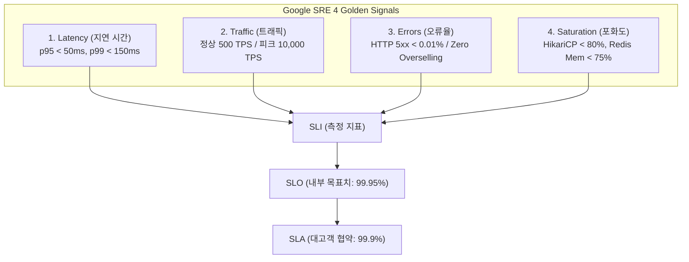
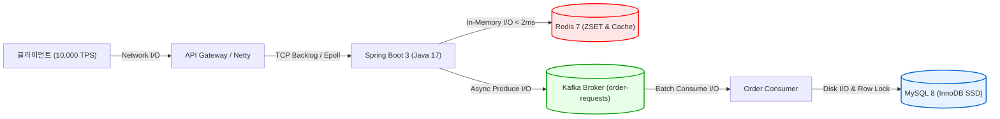

# 04. 대규모 트래픽 성능 평가 체계, SLO, I/O 지표 및 도메인 표준 분석서

> **작성 주체:** `@PerformanceArchitect` (Principal Performance Architect & SRE Specialist)  
> **적용 대상:** 위버스컴퍼니 수준 대규모 선착순 예매 시스템 (피크 1,000 ~ 10,000 TPS)

---

## 1. 국제 표준 (ISO/IEC 25010) 기반 성능 평가 체계

ISO/IEC 25010 소프트웨어 품질 모델의 **성능 효율성 (Performance Efficiency)** 3대 핵심 하위 특성을 기준으로 시스템을 평가합니다.

| 품질 특성 (Sub-characteristic) | 정의 및 평가 기준 | 본 프로젝트 적용 기준 & 목표치 |
| :--- | :--- | :--- |
| **시간 행동 (Time Behaviour)** | 명시된 조건에서 작업을 수행할 때의 응답 시간, 처리 시간 및 처리율 | - **대기열 폴링 (p95):** $\le 50\text{ms}$ - **상품/재고 조회 (p95):** $\le 30\text{ms}$ - **선착순 주문 접수 (p99):** $\le 150\text{ms}$ |
| **자원 이용 (Resource Utilization)** | 소프트웨어 수행 시 사용하는 자원의 양과 유형 (CPU, Memory, I/O) | - **CPU 사용률:** 피크 시 $\le 75\%$ - **JVM Heap:** $\le 70\%$ (GC Pause < 50ms) - **HikariCP 커넥션 풀 경합:** 대기 시간 < 10ms |
| **용량성 (Capacity)** | 시스템의 최대 한계 용량 (동시 사용자, 동시 트랜잭션) | - **동시 대기 인원:** 최대 500,000명 수용 - **초당 최대 유입 (Peak Throughput):** 10,000 TPS |

---

## 2. Google SRE 4대 골든 시그널 기반 SLO / SLI / SLA 체계

### 2.1. 도메인별 세부 SLO / SLI 목표 명세

| 도메인 / API | SLI (Service Level Indicator) | SLO (Service Level Objective) | 측정 방식 |
| :--- | :--- | :--- | :--- |
| **대기열 (Queue Domain)** | `GET /api/v1/queue/status` 요청 중 100ms 이내에 정상 응답(200 OK)된 비율 | **99.9% 이상** | Prometheus / Actuator `http.server.requests` |
| **상품 조회 (CQRS Read)** | `GET /api/v1/products/{id}` 요청 중 Redis 캐시에서 30ms 이내에 반환된 비율 | **99.95% 이상** | Cache Hit Ratio 및 Micrometer 타이머 |
| **선착순 주문 (EDA Write)** | `POST /api/v1/orders` 요청이 200ms 이내에 `202 ACCEPTED`를 반환하고 Kafka에 적재된 비율 | **99.9% 이상** | Kafka Producer Ack Latency + Controller Latency |
| **재고 정합성 (Data Integrity)** | 100개 한정 수량 판매 시 초과 주문(Overselling) 건수 | **0건 (Zero Tolerance / 100%)** | 주문 완료 테이블 Count vs 상품 초기 재고 검증 |

---

## 3. 핵심 I/O 및 시스템 병목 지표 분석 (I/O Bottlenecks)

대규모 트래픽 발생 시 병목이 발생할 수 있는 4대 I/O 계층의 한계치 및 튜닝 가이드입니다.

### 3.1. 계층별 I/O 지표 및 임계치 기준

| 계층 | 핵심 I/O 메트릭 | 정상 임계치 | 위험/조치 임계치 | 병목 발생 시 현상 및 방어 전략 |
| :--- | :--- | :--- | :--- | :--- |
| **Redis (In-Memory)** | - `instantaneous_ops_per_sec` - `p99 command_latency` - `used_memory_rss` - `mem_fragmentation_ratio` | - OPS: 50,000+ - 지연: $\le 1.5\text{ms}$ - 파편화율: $1.0 \sim 1.4$ | - 지연: $> 5\text{ms}$ - 파편화율: $> 1.8$ - Eviction 발생 시 | **대책:** `maxmemory-policy noeviction` 적용, O(N) 명령어(`KEYS`, `SMEMBERS`) 절대 금지, Pipeline/Lua Script 원자화 |
| **DB Connection (HikariCP)** | - `ActiveConnections` - `PendingThreads` - `ConnectionTimeout` - `ConnectionCreationTime` | - Active: $\le 80\%$ - Pending: $0$ - Wait: $\le 5\text{ms}$ | - Pending: $> 10$ - Timeout 발생 시 | **대책:** Command/Query 분리(CQRS)로 RDB 조회 차단, 주문은 Kafka 비동기 처리하여 커넥션 점유 최소화 |
| **Kafka (Event Stream)** | - `Consumer Lag` - `UnderReplicatedPartitions` - `network_io_rate` - `flush_time` | - Lag: $\le 500$ - Partition: 0 | - Lag: $> 5,000$ - ISR 축소 시 | **대책:** `productId` 파티션 키 기반 순서 보장, 배치 처리(`batch.size`, `linger.ms`), Consumer Concurrency 증설 |
| **디스크 & 네트워크 (OS)** | - `Disk IOPS` - `%iowait` - `TCP syn_backlog` - `Network Bandwidth` | - iowait: $\le 5\%$ - TCP Drop: 0 | - iowait: $> 15\%$ - SYN Drop 발생 시 | **대책:** MySQL InnoDB Redo Log / Doublewrite 버퍼 튜닝, OS `somaxconn` 및 `tcp_max_syn_backlog` 상향 |

---

## 4. 도메인(선착순 티켓팅/이커머스) 통용 기준 비교표

글로벌 선착순 이커머스/티켓팅 시스템(Weverse, Interpark, Ticketmaster, Lotte ON)의 엔지니어링 표준 기준입니다.

| 평가 항목 | 일반 웹 서비스 | 대규모 선착순 예매 시스템 (Weverse 기준) | 우리 시스템 설계 반영 상태 |
| :--- | :--- | :--- | :--- |
| **트래픽 인입 패턴** | 평탄한 곡선형 트래픽 | **오픈 0.1초 만에 100배 스파이크 (Flash Crowd)** | ✅ Redis ZSET 대기열로 버퍼링 |
| **동시성 처리 방식** | DB 트랜잭션 락 (`FOR UPDATE`) | **Redis 원자적 카운터 + 비동기 큐 (EDA)** | ✅ Kafka Producer / Redis DECR 분리 |
| **조회(Read) 전략** | RDB 복제본(Read Replica) 조회 | **In-Memory CQRS Cache-Aside / Write-Through** | ✅ ProductQueryService Redis 우선 조회 |
| **초과 판매(Oversell) 허용** | 취소 후 환불 처리 (일부 허용) | **절대 불가 (Zero Overselling)** | ✅ Redis 원자적 선점 및 TODO 가드레일 |
| **장애 격리 (Fault Tolerance)** | 단일 DB 병목 시 전면 다운 | **대기열/조회/주문 계층 간 독립 장애 격리** | ✅ Modular Monolith & Async Pipeline |

---

## 5. 성능 검증 (Performance Testing) 시나리오 가이드

성능 아키텍트 관점에서 향후 k6 부하 테스트 시 실행할 표준 시나리오입니다:

1. **Smoke Test:** 50 VUs (Virtual Users) $\rightarrow$ 기본 대기열 및 조회 응답성 검증 (1분)
2. **Load Test:** 1,000 VUs $\rightarrow$ 목표 처리량(1,000 TPS)에서 p99 < 150ms 유지 여부 검증 (5분)
3. **Stress / Spike Test:** 순간 5,000 ~ 10,000 VUs 급증 $\rightarrow$ 대기열 순번 정합성, Connection Pool 고갈 여부, 재고 100개 완판 시 초과 판매 0건 검증 (3분)