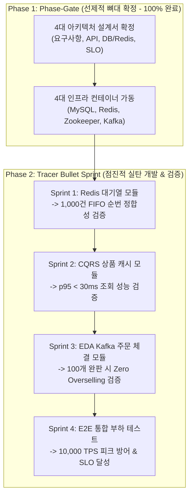

# 05. 개발 착수 전략 및 스프린트 로드맵 (Development Strategy & Roadmap)

> **작성 주체:** 메인 오케스트레이터 (`@Mentor`) & 백엔드 엔지니어링 팀 (`@Engineer`, `@SRE`, `@PerformanceArchitect`, `@TechWriter`)  
> **적용 프로젝트:** 위버스컴퍼니 수준 대규모 선착순 구매 시스템  
> **문서 버전:** v1.0.0 (2026. 09. 01)

---

## 1. 개발 철학: Hybrid Phase-Gate & Tracer Bullet Agile

우리는 대규모 트래픽 분산 시스템 개발 시 흔히 빠지는 **두 가지 극단적인 실패 패턴**을 지양하고, **실무 테크 기업(위버스, 쿠팡, 토스)의 하이브리드 애자일 전략**을 채택합니다.



### ⚖️ 두 극단의 한계와 우리의 해결책

| 접근 방식 | 문제점 및 리스크 | 우리 팀의 해결 전략 |
| :--- | :--- | :--- |
| **극단적 폭포수 (BDUF)** | 코드 없이 종이 위에서만 고민하다가 **분석 마비(Analysis Paralysis)**에 빠짐 | 인프라/API/DB 뼈대만 단단히 선제 정의하고 **즉시 코드 구현으로 전환** |
| **극단적 애자일 (Just Code It)** | 동기식 DB 구조로 막 짰다가 비동기로 전환 시 **전체 코드를 폐기하고 재시공** | **Modular Monolith, EDA, CQRS 인터페이스 뼈대**를 미리 세워두고 도메인별 점진 구현 |

---

## 2. 4단계 점진적 스프린트 로드맵 (Sprint Roadmap)

전체 시스템을 한 번에 다 만들지 않고, **기능 단위로 개발 $\rightarrow$ 테스트 $\rightarrow$ 커밋/푸시 $\rightarrow$ 머지**를 반복하는 애자일 이터레이션을 수행합니다.

---

### 🏃 Sprint 1: Redis ZSET 기반 선착순 대기열 모듈
- **작업 브랜치:** `feature/#1-redis-waiting-queue`
- **담당 에이전트:** `@Engineer` (구현), `@SRE` (Redis ZSET 튜닝)
- **주요 구현 범위:**
  1. `POST /api/v1/queue/enter`: Redis Sorted Set(`ZADD`) 기반 진입 및 대기 토큰 발급
  2. `GET /api/v1/queue/status`: `ZRANK` 기반 실시간 대기 순번 및 잔여 대기자 수 폴링
  3. `QueueTokenService`: 스케줄러 기반 일정 주기(초당 N명) 대기 토큰 `ACTIVE` 승급 및 TTL(5분) 관리
- **완료 및 검증 기준 (Definition of Done):**
  - 1,000개 토큰 동시 진입 시 **FIFO 순번 중복 및 누락 0건** 단위/동시성 테스트 통과

---

### 🏃 Sprint 2: CQRS 기반 상품 상세 및 잔여 재고 캐싱 모듈
- **작업 브랜치:** `feature/#2-product-cqrs-cache`
- **담당 에이전트:** `@Engineer` (구현), `@PerformanceArchitect` (SLO 검증)
- **주요 구현 범위:**
  1. `GET /api/v1/products/{id}`: Redis Cache-Aside 패턴 기반 상품 상세 조회
  2. `GET /api/v1/products/{id}/stock`: In-Memory 잔여 재고 조회
  3. Cache Miss 시에만 RDBMS 조회 및 Redis 캐시 워밍(TTL 설정)
- **완료 및 검증 기준 (Definition of Done):**
  - 캐시 히트 시 **응답 지연 시간 p95 < 30ms** 달성 및 DB I/O 부하 90% 이상 절감 확인

---

### 🏃 Sprint 3: EDA 기반 Kafka 비동기 주문 및 원자적 재고 차감
- **작업 브랜치:** `feature/#3-order-eda-kafka`
- **담당 에이전트:** `@Engineer` (비동기 주문), `@Mentor` (동시성 제어 멘토링)
- **주요 구현 범위:**
  1. `POST /api/v1/orders`: `Active Token` 검증 $\rightarrow$ Redis 원자적 재고 선점(`DECR`) $\rightarrow$ Kafka 주문 이벤트 발행 $\rightarrow$ **`202 ACCEPTED` 즉시 응답**
  2. `KafkaOrderConsumer`: 백그라운드에서 순차적으로 주문 이벤트 소비 $\rightarrow$ MySQL `orders`, `order_items` 영속화 및 상태 갱신
  3. `GET /api/v1/orders/{orderNumber}`: 주문 체결 최종 상태 조회
- **완료 및 검증 기준 (Definition of Done):**
  - 100개 한정 수량에 1,000건 동시 주문 인입 시 **정확히 100건만 체결되고 초과 판매(Overselling) 0건** 검증

---

### 🏃 Sprint 4: E2E 통합 부하 테스트 및 SLO 달성 검증
- **작업 브랜치:** `feature/#4-load-testing-slo`
- **담당 에이전트:** `@PerformanceArchitect`, `@SRE`
- **주요 구현 범위:**
  1. k6 부하 테스트 스크립트 작성 (대기열 진입 $\rightarrow$ 폴링 $\rightarrow$ 조회 $\rightarrow$ 주문 E2E 시나리오)
  2. 1,000 ~ 10,000 TPS 스파이크 부하 주입
  3. Google SRE 4대 황금 신호(Latency, Traffic, Errors, Saturation) 메트릭 측정
- **완료 및 검증 기준 (Definition of Done):**
  - 피크 트래픽 하에서 **시스템 무장애(5xx 에러 < 0.01%) 및 p99 < 150ms** 달성

---

## 3. 기능 개발 및 협업 라이프사이클 (Git & PR Standard)

모든 스프린트는 [AGENTS.md](file:///Users/kimtaewoo/project/wevers_toy_project/AGENTS.md) 제5조(Git push & commit 및 브랜치 규칙)를 엄격히 준수합니다.

```text
[Step 1: 브랜치 생성]
develop -> feature/#이슈번호-기능명 분기

[Step 2: TDD & 도메인 구현]
단위 테스트 작성 -> 서비스/컨트롤러 구현 -> 동시성 검증

[Step 3: 자동화 검증 및 커밋]
./gradlew clean build test (컴파일/테스트 100% PASS 확인)
git commit -m "한글 커밋 메시지" && git push origin feature/#이슈번호

[Step 4: PR 생성 및 머지]
PR 제목: [FEAT] #이슈번호: 간단한 제목
코드 리뷰 및 CI/CD 검증 완료 후 develop 브랜치로 Merge
```

---

## 4. 멀티 에이전트 모니터링 출력 가이드

작업을 수행할 때마다 서브 에이전트들의 이행 상태를 다음 형식으로 실시간 모니터링하여 출력합니다:

```text
┌───────────────────────────────────────────────────────────────────────────────────┐
│                      🤖 MULTI-AGENT TASK MONITORING DASHBOARD                     │
├──────────────────────┬───────────────────────────────┬────────────┬───────────────┤
│ Agent                │ Assigned Task Domain          │ Status     │ Key Output    │
├──────────────────────┼───────────────────────────────┼────────────┼───────────────┤
│ 👨‍💻 @Engineer         │ {현재 도메인 구현 작업}       │ IN_PROGRESS│ {산출물/코드} │
│ 🛠️ @SRE              │ {인프라/컨테이너 모니터링}     │ UP_AND_RUN │ {헬스체크}    │
│ 📊 @PerformanceArch  │ {SLO 및 동시성 병목 점검}     │ MONITORING │ {지연시간}    │
│ 📝 @TechWriter       │ {기술 문서화 및 산출물 정리}  │ UPDATED    │ {문서명}      │
└──────────────────────┴───────────────────────────────┴────────────┴───────────────┘
```
