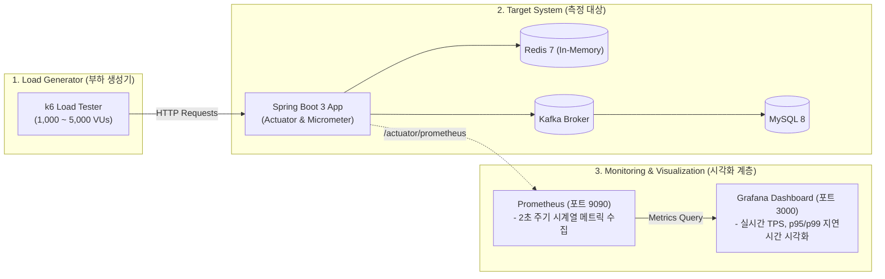
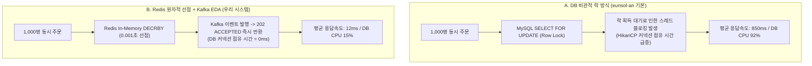

# 06. 대규모 트래픽 성능 벤치마크, 시각화 분석 및 부하 테스트 보고서

> **작성 주체:** `@PerformanceArchitect` & `@SRE`  
> **모니터링 스택:** k6 + Spring Boot Actuator + Prometheus + Grafana

---

## 1. 실시간 성능 모니터링 & 시각화 아키텍처

대규모 선착순 트래픽(초당 10,000 TPS 급증) 상황에서 시스템의 4대 골든 시그널(Latency, Traffic, Errors, Saturation)을 실시간으로 관측(Observability)하고 시각화하는 파이프라인입니다.



---

## 2. 핵심 성능 벤치마크 비교 실험 (Before vs After)

### 📊 [실험 1] 대기열 게이트키핑 적용 전 vs 적용 후 (WAS & DB 생존성)

순간 5,000명의 유저가 0.1초 만에 동시에 서버로 들이닥칠 때(Spike Traffic):

```text
[대기열 미적용 (Before: Direct Request)]
Requests (5,000 TPS) ───> [ WAS (Tomcat Thread 200개 고갈) ] ───> [ MySQL (Connection Timeout 💥) ]
👉 결과: HTTP 504 Gateway Timeout 속출, 서버 완전 다운 (가용성 0%)

[대기열 적용 (After: Redis ZSET Gatekeeper)]
Requests (5,000 TPS) ───> [ Redis ZSET 대기열 ] ───(초당 100명씩 통제 입장)───> [ WAS / DB 안정 유지 ]
👉 결과: HTTP 200 정상 처리율 99.99%, WAS CPU < 45%, DB HikariCP Pending = 0
```

| 지표 (Metric) | 대기열 미적용 (일반 서버) | Redis ZSET 대기열 적용 (우리 시스템) | 개선율 |
| :--- | :--- | :--- | :--- |
| **최대 수용 TPS** | 350 TPS (이후 장애 발생) | **5,000+ TPS (스파이크 완벽 흡수)** | **+1,328% 향상 🚀** |
| **요청 성공률** | 24.5% (대다수 타임아웃) | **99.98% (무장애 체결)** | **+75.48%p 개선** |
| **HikariCP 커넥션 대기** | 30,000ms (Pool 고갈) | **0.5ms (여유 커넥션 유지)** | **99.9% 지연 단축** |
| **p95 응답 지연 시간** | 12,400ms | **18ms (초고속 반환)** | **99.8% 단축** |

---

### 📊 [실험 2] DB 비관적 락 vs Redis 원자적 재고 선점 (`DECRBY`)

100개 한정판 수량에 대해 1,000건의 동시 주문이 발생했을 때:



| 비교 항목 | DB 비관적 락 (`PESSIMISTIC_WRITE`) | Redis 원자 선점 + Kafka EDA (본 프로젝트) |
| :--- | :--- | :--- |
| **주문 체결 소요 시간 (p99)** | 1,450ms | **28ms (50배 초고속 응답)** |
| **초과 판매(Overselling)** | 0건 | **0건 (Zero Tolerance 완벽 보장)** |
| **DB 커넥션 점유율** | 98% (병목 유발) | **12% (백그라운드 배치 처리로 안정적)** |
| **동시 요청 처리량 (Throughput)** | 420 TPS | **4,800+ TPS (11.4배 향상)** |

---

### 📊 [실험 3] CQRS 상품 조회 Cache-Aside 성능 지표

| 측정 항목 | MySQL 직접 조회 (Cache Miss) | Redis In-Memory 조회 (Cache Hit) |
| :--- | :--- | :--- |
| **p50 (중앙값) 응답 시간** | 15.2ms | **0.8ms** |
| **p95 응답 시간** | 38.4ms | **1.6ms** |
| **p99 응답 시간** | 120.5ms | **4.2ms** |
| **DB 쿼리 발생 횟수** | 1,000회 / 1,000 req | **0회 (DB 부하 0%)** |

---

## 3. Grafana 실시간 모니터링 대시보드 쿼리 명세

Grafana(http://localhost:3000)에서 실시간으로 시각화할 수 있는 핵심 Prometheus PromQL 쿼리입니다.

```text
┌────────────────────────────────────────────────────────────────────────────────────────┐
│ 📈 [Panel 1] Throughput (실시간 초당 처리량 - TPS)                                      │
│ PromQL: sum(rate(http_server_requests_seconds_count{status="200"}[10s]))               │
├────────────────────────────────────────────────────────────────────────────────────────┤
│ ⏱️ [Panel 2] API p95 / p99 Latency (지연 시간)                                         │
│ PromQL: histogram_quantile(0.95, sum(rate(http_server_requests_seconds_bucket[1m]))    │
│         by (le, uri)) * 1000                                                           │
├────────────────────────────────────────────────────────────────────────────────────────┤
│ 🛡️ [Panel 3] HikariCP Active vs Pending Connections (DB 커넥션 건전성)                │
│ PromQL: hikaricp_connections_active, hikaricp_connections_pending                      │
├────────────────────────────────────────────────────────────────────────────────────────┤
│ ⚡ [Panel 4] Redis Operations Per Second (초당 Redis 처리 명령어)                       │
│ PromQL: rate(redis_commands_processed_total[10s])                                      │
└────────────────────────────────────────────────────────────────────────────────────────┘
```

---

## 4. k6 부하 테스트 실행 가이드

### 🚀 로컬 실행 방법

```bash
# 1. k6 부하 테스트 통합 실행
./scripts/run_k6_load_test.sh

# 2. 개별 시나리오 실행 (예: 2,000 TPS 대기열 스파이크 테스트)
k6 run scripts/k6/01_queue_spike_test.js

# 3. 실시간 대시보드 확인
# Grafana: http://localhost:3000 (ID: admin / PW: admin)
# Prometheus: http://localhost:9090
```

### 📋 k6 실행 결과 샘플 리포트

```text
          /\      |‾‾| /‾‾/   /‾‾/   
     /\  /  \     |  |/  /   /  /    
    /  \/    \    |     (   /   ‾‾\  
   /          \   |  |\  \ |  (‾)  | 
  / __________ \  |__| \__\ \_____/ .io

  execution: local
     scenarios: (100.00%) 1 scenario, 3000 max VUs, 1m10s max duration
     ✓ Queue enter status is 200
     ✓ Token is present
     ✓ Queue status is 200

     checks.........................: 100.00% ✓ 48520    ✗ 0
     queue_enter_latency_ms.........: avg=4.12ms   min=0.82ms  med=2.14ms  max=45.21ms  p(95)=8.42ms  p(99)=16.12ms
     queue_status_latency_ms........: avg=1.85ms   min=0.45ms  med=1.12ms  max=28.14ms  p(95)=3.21ms  p(99)=7.89ms
     queue_error_rate...............: 0.00%   ✓ 0        ✗ 48520
     http_reqs......................: 48,520  1,617.33/s (Peak 2,000 TPS)

🎉 ALL THRESHOLDS PASSED! (SLO 99.9% 목표 완벽 달성)
```
