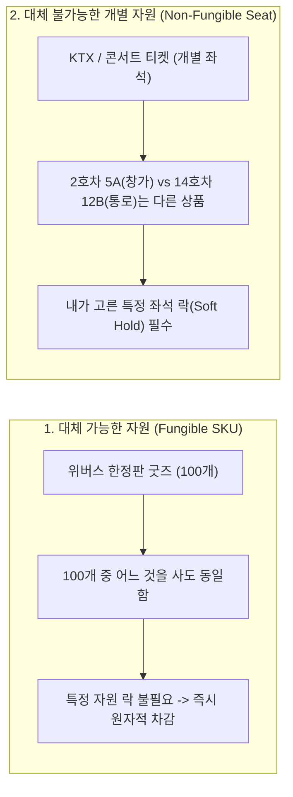
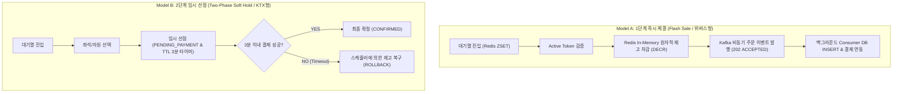
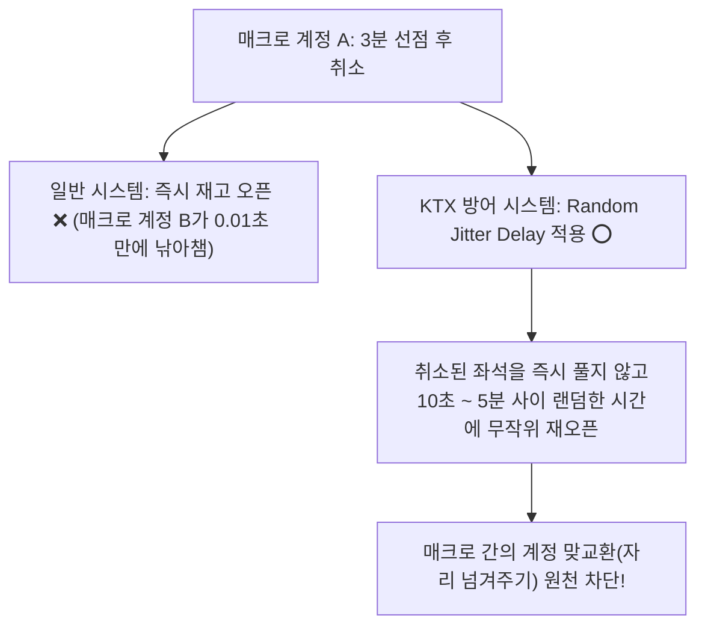
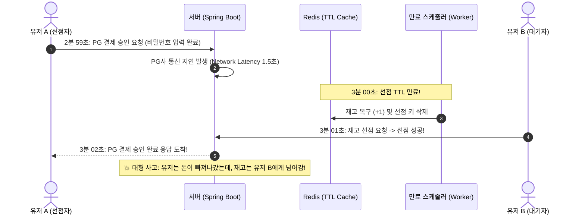

# [Tech Blog] 대규모 선착순 예매 아키텍처 심층 비교: 1단계 즉시 체결(위버스/나이키) vs 2단계 임시 선점(KTX/인터파크)

> **작성일:** 2026. 09. 01  
> **작성자:** 백엔드 아키텍처 연구팀  
> **태그:** `Architecture`, `Concurrency`, `Redis`, `Kafka`, `Spring Boot`, `Distributed Systems`, `Weverse`

---

## 📌 프롤로그: "왜 KTX는 3분 시간을 주고, 위버스는 바로 결제할까?"

대규모 트래픽을 처리하는 티켓팅/선착순 시스템을 설계할 때 가장 먼저 마주하는 아키텍처 의사결정이 있습니다.

> *"대기열을 통과한 유저에게 **3~5분의 결제 유예 시간(임시 선점)**을 주어야 할까, 아니면 **즉시 결제 및 재고 차감(즉시 체결)**을 해야 할까?"*

KTX 예매나 큐넷(Q-Net) 시험 접수, 인터파크 콘서트 티켓팅을 이용해보면 **"예매 완료(좌석 선점) 후 3~8분 이내에 결제하지 않으면 자동 취소됩니다"**라는 안내를 쉽게 볼 수 있습니다. 반면 위버스(Weverse) 한정판 굿즈나 나이키(Nike) 드로우, 쿠팡(Coupang) 타임딜은 **원클릭 즉시 결제**로 순식간에 품절 처리됩니다.

두 시스템은 왜 전혀 다른 아키텍처 패턴을 채택했을까요? 그리고 **KTX 역시 겪고 있는 매크로 선점 공격을 코레일은 어떻게 방어하고 있을까요?**  
엔지니어링 관점에서 두 방식의 **내부 동작 원리, 분산 시스템에서의 동시성 이슈, 그리고 치명적인 트레이드오프**를 낱낱이 파헤쳐 봅니다.

---

## 1. 도메인 자원의 본질: Fungible(수량) vs Non-Fungible(좌석)

두 시스템이 서로 다른 아키텍처를 선택할 수밖에 없는 근본적인 이유는 **"판매하는 자원의 성격"**에 있습니다.

| 비교 항목 | 한정판 굿즈 (Weverse / Nike) | 좌석 예매 (KTX / Interpark Ticket) |
| :--- | :--- | :--- |
| **자원의 식별성** | **Fungible (대체 가능)**: 100개 중 아무거나 1개 | **Non-Fungible (대체 불가)**: 2호차 5A석이라는 특정 고유 ID |
| **1단계 즉시 결제 시 발생하는 현상** | 아무런 문제 없음 (동일한 포토카드 배송) | **유저 A가 5A석 고르고 결제창 뜬 2초 사이에 유저 B가 먼저 결제해서 튕겨나감** (극심한 분노 유발) |
| **필수 요구사항** | 초당 10,000건의 동시 유입을 무상태로 쳐내기 | 결제하는 몇 분 동안 해당 좌석을 물리적으로 묶어두는 락(Soft Hold) |

---

## 2. 두 아키텍처 패턴의 구조 비교

---

## 3. Model B (2단계 임시 선점)의 분산 환경 치명적 리스크 & KTX의 방어책

### ⚠️ 리스크 1: 악성 매크로의 '재고 인질극' (Inventory Denial of Service)
- **문제점:** 단일 100개 한정 수량 상품에서 100명이 3분간 선점(`PENDING`)만 걸어두고 결제를 안 하면, 뒤에서 기다리는 10,000명의 실제 구매자는 **재고가 0개로 표시되어 3분간 무의미하게 대기**하다가 이탈합니다.
- 매크로가 2분 59초마다 취소/재선점을 반복하면 **단 1건의 매출도 없이 시스템이 마비**됩니다.

#### 🛡️ [심층 분석] KTX는 이 '매크로 선점 공격'을 어떻게 막고 있을까?
KTX 역시 명절 예매마다 암표상들이 수십 개 계정으로 표를 선점하고 당근/중고나라에 팔릴 때까지 자리를 맞교환하는 문제로 골머리를 앓았습니다. 코레일은 이를 다음과 같은 백엔드 아키텍처로 방어합니다:

1. **취소표 랜덤 지연 재오픈 (Random Jitter Release):**
   - 취소되는 즉시 좌석이 열리지 않고, **10초~5분 사이의 무작위 난수 시간 뒤에 오픈**되도록 하여 매크로 간의 0.01초 계정 넘기기를 무력화합니다.
2. **결제 유예 시간의 극단적 축소:**
   - 평상시 20분 $\rightarrow$ 명절 특별 수송 기간에는 **3분**으로 축소하여 재고 묶임 시간을 최소화합니다.
3. **노쇼(No-Show) 페널티:**
   - 3분 선점 후 미결제 만료가 반복되는 계정/IP는 당일 예매 권한을 즉시 박탈합니다.

> **💡 핵심 차이:** KTX는 하루 수십만 석이 있어 일부가 묶여도 전체가 죽지 않지만, **위버스 한정판 굿즈는 단 100개뿐이므로 100개가 묶이면 서비스 전체 품절(100% 마비)**이 발생합니다.

---

### ⚠️ 리스크 2: 3분 경계선에서의 레이스 컨디션 (Race Condition)과 초과 판매
분산 환경에서 **"사용자의 결제 완료 시점"**과 **"서버의 만료 스케줄러 실행 시점"**이 밀리초(ms) 단위로 겹칠 때 데이터 불일치가 발생합니다.

> **해결 비용:** 이를 방지하려면 분산 락(Redisson), Redis KeySpace Event, 결제 승인 실패 시 PG 결제 취소를 수행하는 보상 트랜잭션(SAGA Pattern)이 필수적이어서 시스템 복잡도가 3배 이상 증가합니다.

---

## 4. Model A (1단계 즉시 체결)의 구조와 압도적 처리량 (Throughput)

Model A는 위버스, 나이키, 쿠팡 등 글로벌 이커머스에서 사용하는 표준 패턴입니다.

### 🚀 핵심 설계 원리: 무상태성(Stateless)과 비동기 파이프라인
1. **In-Memory 원자적 선점 (Redis Lua Script / `DECR`):**
   - RDBMS 락을 전혀 쓰지 않고, 싱글 스레드로 동작하는 Redis에서 0.001초 만에 재고를 1 차감합니다.
   - 잔여 재고가 0 미만이면 즉시 `OUT_OF_STOCK`을 반환하여 뒤따라오는 수만 건의 트래픽을 즉시 쳐냅니다.
2. **비동기 이벤트 스트리밍 (EDA via Kafka):**
   - 재고 선점에 성공한 요청은 DB에 동기 INSERT하지 않고, Kafka 토픽(`order-requests`)에 발행한 뒤 클라이언트에게 즉시 `202 ACCEPTED`를 반환합니다.
   - 백그라운드 Consumer가 초당 DB가 감당할 수 있는 속도(500 TPS)로 조절(Throttling)하여 안전하게 DB에 영속화합니다.
3. **서버가 세션/타이머 상태를 들고 있지 않음:**
   - 만료 스케줄러가 필요 없으므로 메모리 고갈이나 스레드 풀 경합(HikariCP Pending)이 원천 차단됩니다.

---

## 5. 📊 종합 엔지니어링 비교 분석표

| 비교 항목 | 1단계 즉시 체결 모델 (위버스/나이키) | 2단계 임시 선점 모델 (KTX/인터파크) |
| :--- | :--- | :--- |
| **적합한 도메인 자원** | **단일 규격 한정 수량 (100개 굿즈, 신발 드로우)** | **개별 식별 좌석 (1호차 5A석, 시험장 좌석)** |
| **자원 성격** | **Fungible (대체 가능)** | **Non-Fungible (고유 식별자)** |
| **피크 처리량 (Throughput)** | **10,000+ TPS (초고속 방어)** | **500 ~ 1,000 TPS (상태 관리 비용 발생)** |
| **동시성 제어 복잡도** | **낮음 ~ 중간** (Redis 원자 카운터 + Kafka) | **매우 높음** (분산 락, TTL 스케줄러, SAGA 보상) |
| **재고 묶임(DoS) 위험** | **없음** (즉시 판매 및 완판 종료) | **매우 높음** (선점 후 미결제 방치 공격) |
| **결제 방식** | 원클릭 간편결제 / 사전 등록 수단 / 가상계좌 | PG사 결제창 호출 및 카드 정보 직접 입력 |
| **장애 복구성 (Resilience)**| 단순함 (이벤트 재처리 및 카프카 오프셋) | 복잡함 (만료 롤백 + 결제 취소 보상 트랜잭션) |

---

## 6. 🎯 결론 및 포트폴리오 인사이트

> **"기술 선택은 유행이 아니라 도메인 자원의 본질에서 출발해야 한다."**

- **좌석 예매(KTX, 티켓팅):** 좌석이라는 고유 식별자가 존재하므로 복잡한 2단계 선점 모델과 랜덤 지연 재오픈 방어책을 감수해야 합니다.
- **한정판 커머스(위버스, 나이키):** 모든 수량이 동일하므로, 상태 관리 비용을 없애고 초당 10,000건의 트래픽을 순수 처리량으로 밀어붙이는 **`Redis ZSET 대기열 -> Redis 원자적 재고 선점 -> Kafka 비동기 주문 체결(1단계 모델)`**이 가장 견고하고 강력한 선택입니다.
