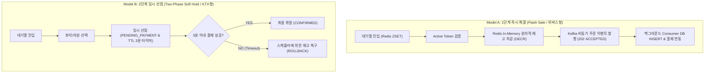
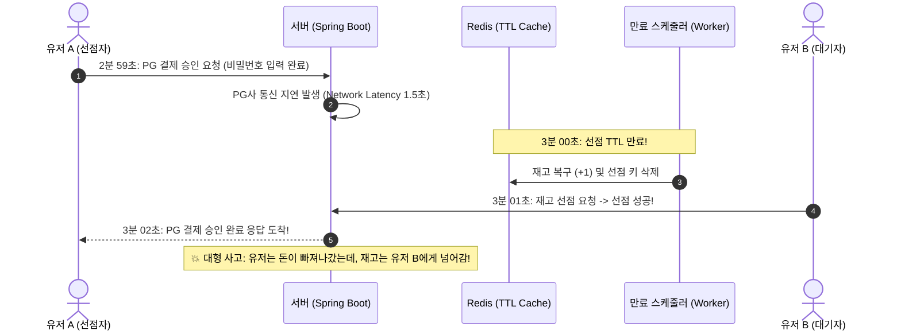

# [Tech Blog] 대규모 선착순 예매 아키텍처 심층 비교: 1단계 즉시 체결(위버스/나이키) vs 2단계 임시 선점(KTX/인터파크)

> **작성일:** 2026. 09. 01  
> **태그:** `Architecture`, `Concurrency`, `Redis`, `Kafka`, `Spring Boot`, `Distributed Systems`

---

## 📌 프롤로그: "왜 KTX는 3분 시간을 주고, 위버스는 바로 결제할까?"

대규모 트래픽을 처리하는 티켓팅/선착순 시스템을 설계할 때 가장 먼저 마주하는 아키텍처 의사결정이 있습니다.

> *"대기열을 통과한 유저에게 **3~5분의 결제 유예 시간(임시 선점)**을 주어야 할까, 아니면 **즉시 결제 및 재고 차감(즉시 체결)**을 해야 할까?"*

KTX 예매나 큐넷(Q-Net) 시험 접수, 인터파크 콘서트 티켓팅을 이용해보면 **"예매 완료(좌석 선점) 후 3~8분 이내에 결제하지 않으면 자동 취소됩니다"**라는 안내를 쉽게 볼 수 있습니다. 반면 위버스(Weverse) 한정판 굿즈나 나이키(Nike) 드로우, 쿠팡(Coupang) 타임딜은 **원클릭 즉시 결제**로 순식간에 품절 처리됩니다.

두 시스템은 왜 전혀 다른 아키텍처 패턴을 채택했을까요? 두 방식의 **내부 동작 원리, 분산 시스템에서의 동시성 이슈, 그리고 치명적인 트레이드오프**를 엔지니어링 관점에서 낱낱이 파헤쳐 봅니다.

---

## 1. 두 아키텍처 패턴의 구조 비교

---

## 2. Model B (2단계 임시 선점)의 구조와 분산 환경의 치명적 리스크

Model B는 사용자에게 결제 수단을 입력할 시간적 여유를 제공하지만, **초당 수천~수만 건의 트래픽이 몰리는 분산 환경에서는 시스템 복잡도를 기하급수적으로 폭증**시킵니다.

### ⚠️ 리스크 1: 악성 매크로의 '재고 인질극' (Inventory Denial of Service)
- KTX는 '개별 좌석(1호차 5A)'이 분산되어 있지만, 한정판 굿즈는 **'단일 상품 100개'**입니다.
- 악의적인 봇이 100개의 재고를 전부 3분 선점(`PENDING`) 상태로 묶어두면, 뒤에서 기다리는 10,000명의 실제 구매자는 **재고가 0개로 표시되어 아무것도 하지 못한 채 3분간 대기하다 이탈**합니다.
- 매크로가 2분 59초마다 선점 취소와 재선점을 반복하면 **단 1건의 실제 매출도 발생하지 않은 채 서비스가 마비**됩니다.

### ⚠️ 리스크 2: 3분 경계선에서의 레이스 컨디션 (Race Condition)과 초과 판매
분산 환경에서 **"사용자의 결제 완료 시점"**과 **"서버의 만료 스케줄러 실행 시점"**이 밀리초(ms) 단위로 겹칠 때 데이터 불일치가 발생합니다.

> **해결 비용:** 이를 방지하려면 분산 락(Distributed Lock), Redis KeySpace Notification, 결제 승인 실패 시 PG 결제 취소를 수행하는 보상 트랜잭션(SAGA Pattern)이 필수적이어서 아키텍처가 매우 무거워집니다.

### ⚠️ 리스크 3: 재고 진동 현상 (Inventory Flapping)
- 100개가 순식간에 선점되어 캐시 상 **"품절(Sold Out)"** 처리되었으나, 3분 뒤 40명이 결제를 포기하여 40개가 다시 풀립니다.
- 유저 입장에서는 "방금 품절이라더니 왜 다시 구매가 되지?"라는 불신이 생기며, 대기열과 상품 조회 캐시가 3분 주기로 요동칩니다.

---

## 3. Model A (1단계 즉시 체결)의 구조와 압도적 처리량 (Throughput)

Model A는 위버스, 나이키, 쿠팡 등 글로벌 이커머스에서 사용하는 표준 패턴입니다.

### 🚀 핵심 설계 원리: 무상태성(Stateless)과 비동기 파이프라인
1. **In-Memory 원자적 선점 (Redis Lua Script / `DECR`):**
   - RDBMS 락을 전혀 쓰지 않고, 싱글 스레드로 동작하는 Redis에서 0.001초 만에 재고를 1 차감합니다.
   - 잔여 재고가 0 미만이면 즉시 `OUT_OF_STOCK`을 반환하여 뒤따라오는 수만 건의 트래픽을 즉시 쳐냅니다.
2. **비동기 이벤트 스트리밍 (EDA via Kafka):**
   - 재고 선점에 성공한 요청은 DB에 동기 INSERT하지 않고, Kafka 토픽(`order-requests`)에 발행한 뒤 클라이언트에게 즉시 `202 ACCEPTED`를 반환합니다.
   - 백그라운드 Consumer가 초당 DB가 감당할 수 있는 속도(500 TPS)로 조절(Throttling)하여 안전하게 DB에 영속화합니다.
3. **서버가 세션/타이머 상태를 들고 있지 않음:**
   - 만료 스케줄러가 필요 없으므로 메모리 고갈이나 스레드 풀 경합(HikariCP Pending)이 원천 차단됩니다.

---

## 4. 📊 종합 엔지니어링 비교 분석표

| 비교 항목 | 1단계 즉시 체결 모델 (위버스/나이키) | 2단계 임시 선점 모델 (KTX/인터파크) |
| :--- | :--- | :--- |
| **적합한 도메인 자원** | **단일 규격 한정 수량 (100개 굿즈, 신발 드로우)** | **개별 식별 좌석 (1호차 5A석, 시험장 좌석)** |
| **피크 처리량 (Throughput)** | **10,000+ TPS (초고속 방어)** | **500 ~ 1,000 TPS (상태 관리 비용 발생)** |
| **동시성 제어 복잡도** | **낮음 ~ 중간** (Redis 원자 카운터 + Kafka) | **매우 높음** (분산 락, TTL 스케줄러, SAGA 보상) |
| **재고 묶임(DoS) 위험** | **없음** (즉시 판매 및 완판 종료) | **매우 높음** (선점 후 미결제 방치 공격) |
| **결제 방식** | 원클릭 간편결제 / 사전 등록 수단 / 가상계좌 | PG사 결제창 호출 및 카드 정보 직접 입력 |
| **장애 복구성 (Resilience)**| 단순함 (이벤트 재처리 및 카프카 오프셋) | 복잡함 (만료 롤백 + 결제 취소 보상 트랜잭션) |

---

## 5. 🎯 결론: 엔지니어링 의사결정 가이드

> **Q. 우리 프로젝트는 어떤 아키텍처를 선택해야 하는가?**

1. **2단계 임시 선점(Two-Phase Hold)을 선택해야 하는 경우:**
   - 사용자가 **"특정 좌석이나 위치"**를 직접 골라야 하는 도메인 (KTX, 비행기, 영화관, 콘서트 지정석).
   - 결제 시 복잡한 추가 정보(수험표 사진 업로드, 할인 쿠폰 선택 등) 입력에 물리적 시간이 필요한 경우.

2. **1단계 즉시 체결(One-Phase Flash Sale)을 선택해야 하는 경우:**
   - **위버스 한정판 굿즈, 명품 드로우, 게임 아이템 선착순 쿠폰**처럼 모든 수량이 동일한 가치를 지닌 단일 SKU 상품.
   - 순간 유입 트래픽이 10,000 TPS 이상으로 폭증하여 **서버의 상태 유지(Stateful Lifecycle) 비용을 0으로 만들어야 하는 경우**.

### 💡 이번 토이 프로젝트의 설계 방향
우리는 **"초당 1,000~10,000건의 트래픽을 견디는 위버스컴퍼니 굿즈 예매 시스템"**을 목표로 하므로, **`Redis Sorted Set 대기열 -> Redis 원자적 재고 선점 -> Kafka 비동기 주문 체결 (1단계 모델)`**을 기본 아키텍처로 채택합니다. 

단, 2단계 모델의 핵심인 **"결제 만료 스케줄러와 분산 트랜잭션 롤백"** 기법은 추후 고급 확장 기능(Advanced Feature)으로 다룸으로써 두 아키텍처의 트레이드오프를 모두 검증할 수 있도록 설계합니다.
