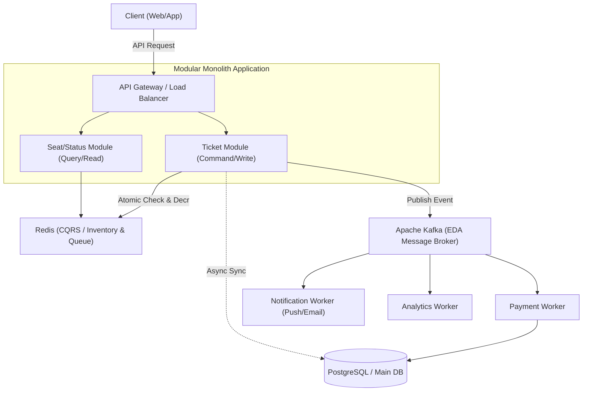

위버스컴퍼니 수준의 대규모 선착순 예매 시스템에 **Modular Monolith, EDA(Kafka), CQRS(Redis)**를 도입하는 이유와 설계 배경을 정리한 TIL 초안을 작성하여 아티팩트로 저장했습니다.

- [til_large_scale_ticket_architecture.md](file:///Users/kimtaewoo/.gemini/antigravity/brain/b85e11fc987ded28c68ded381f803d83/til_large_scale_ticket_architecture.md)

---

# [TIL] 위버스컴퍼니 수준의 대규모 선착순 예매 시스템 아키텍처 설계 배경

> **작성일:** 2026-08-31  
> **주제:** 대규모 트래픽(선착순 콘서트/팬미팅 예매) 처리를 위한 Modular Monolith, EDA(Event-Driven Architecture), CQRS(Command Query Responsibility Segregation) 아키텍처 도입 배경 및 설계 철학

---

## 1. 들어가며: 위버스컴퍼니 트래픽의 특성

위버스컴퍼니와 같은 글로벌 팬덤 플랫폼에서는 유명 아티스트의 콘서트 티켓팅, 팬클럽 선예매 등이 오픈되는 순간 **수백만 명의 트래픽이 0.1초 만에 몰리는 극단적인 트래픽 스파이크(Traffic Spike)**가 발생합니다.

이러한 환경에서는 일반적인 CRUD 웹 애플리케이션 아키텍처로는 시스템 전체가 다운되거나 데이터 정합성이 깨지는 문제가 발생합니다. 따라서 **대규모 동시성 제어, 장애 격리, 읽기/쓰기 성능 극대화**를 동시에 달성할 수 있는 아키텍처 설계가 필수적입니다.

---

## 2. 왜 Microservices 대신 **Modular Monolith**인가?

초기부터 MSA(Microservice Architecture)를 도입하는 경우가 많지만, 대규모 선착순 시스템에서는 오히려 초기 MSA가 독이 될 수 있습니다.

### 2.1. MSA의 함정과 분산 트랜잭션의 한계
* **네트워크 오버헤드와 지연(Latency):** 선착순 예매는 수 밀리초(ms) 단위의 응답 속도가 생명입니다. 서비스 간 통신(gRPC/REST)이 잦아질수록 네트워크 홉(Hop)으로 인한 지연이 누적됩니다.
* **분산 트랜잭션(2PC, Saga 패턴)의 복잡성:** 좌석 예약, 결제, 포인트 차감, 쿠폰 사용 등이 하나의 비즈니스 트랜잭션으로 묶여야 할 때, MSA 환경에서는 분산 트랜잭션 관리(데이터 일관성 보장)가 매우 까다로워집니다.

### 2.2. Modular Monolith의 이점
* **단일 배포 단위의 성능 이점:** 메모리 내(In-Memory) 함수 호출을 활용하여 네트워크 홉을 최소화하고 응답 속도를 극대화합니다.
* **명확한 도메인 경계 (Bounded Context):** 물리적으로는 하나의 모놀리식 애플리케이션이지만, 패키지 및 모듈 수준에서 도메인(`Ticket`, `User`, `Payment`, `Inventory`)을 엄격히 분리합니다.
* **추후 MSA로의 쉬운 전환 (Evolutionary Architecture):** 모듈 간 결합도를 낮추고 인터페이스를 통해 통신하도록 설계하므로, 트래픽이 비대해진 특정 도메인(예: 대기열 또는 예매 엔진)만 향후 독립된 마이크로서비스로 분리하기 용이합니다.

---

## 3. 왜 **EDA (Event-Driven Architecture with Kafka)**인가?

선착순 예매는 '쓰기(Write)' 요청이 순간적으로 폭발합니다. 모든 요청을 동기식 DB 트랜잭션으로 처리하면 DB 커넥션 풀 고갈 및 락(Lock) 경합으로 시스템이 마비됩니다.

### 3.1. 비동기 처리와 백프레셔(Backpressure) 관리
* **이벤트 발행/구독(Pub/Sub):** 예매 요청이 들어오면 검증 후 즉시 `TicketReservedEvent`를 Kafka 토픽에 발행(Produce)하고 사용자에게는 "대기열 등록 완료 / 처리 중" 응답을 내려줍니다.
* **트래픽 평탄화 (Traffic Leveling):** 폭발적인 트래픽을 Kafka의 파티션과 메시지 큐에 안전하게 버퍼링한 뒤, 백엔드 워커(Consumer)가 처리 가능한 속도만큼 안정적으로 소비(Consume)합니다.

### 3.2. 시스템 간 결합도 제거 (Loose Coupling)
* 예매 성공 시 **결제 연동, 알림(푸시/이메일) 발송, 포인트 적립, 통계 집계** 등 부가 작업이 발생합니다.
* 이를 동기식으로 처리하면 하나의 작업 실패가 전체 예매 실패로 이어집니다. EDA를 통해 핵심 예매 도메인은 이벤트 발행에만 집중하고, 부가 서비스들은 이벤트를 비동기로 구독하여 처리함으로써 **장애 격리성(Fault Isolation)**을 확보합니다.

---

## 4. 왜 **CQRS (with Redis)**인가?

티켓팅 오픈 직전에는 수백만 명의 사용자가 **"잔여 좌석이 얼마나 남았지?"**를 확인하기 위해 수많은 **조회(Read) 요청**을 보냅니다. 동시에 결제와 예매라는 **쓰기(Command) 요청**이 폭발합니다.

### 4.1. 읽기와 쓰기의 관심사 분리 (Command Query Responsibility Segregation)
* **Command (쓰기 모델):** 예매/결제와 같이 데이터의 정합성과 동시성 제어가 엄격히 필요한 영역입니다. DB 락 및 Redis 분산 락/Lua 스크립트를 활용해 정확한 재고 감소를 처리합니다.
* **Query (읽기 모델):** 좌석 현황, 남은 티켓 수 조회 등은 상대적으로 엄격한 실시간 ACID 보장보다는 **초고속 응답**이 중요합니다.

### 4.2. Redis를 활용한 인메모리 CQRS 구현
* **In-Memory Cache & Atomic Counter:** 남은 좌석 수나 대기열 순번은 RDB 대신 **Redis**에 적재하여 마이크로초 단위의 초고속 조회를 지원합니다.
* **Lua 스크립트 활용:** Redis 상에서 재고 확인 및 차감을 원자적(Atomic)으로 처리하여 **Race Condition(경쟁 상태)**을 완벽히 방어합니다.
* **Read Cache Sync:** RDB의 최종 확정 데이터를 Redis Read Cache에 동기화하여 대규모 조회 트래픽이 RDB를 직접 타지 않도록 보호합니다.

---

## 5. 아키텍처 요약 다이어그램

---

## 6. 결론

위버스컴퍼니 수준의 대규모 선착순 예매 시스템은 단순한 기능 구현을 넘어 **극한의 동시성과 트래픽 스파이크를 방어하는 아키텍처적 결단**이 요구됩니다.

1. **Modular Monolith**를 통해 불필요한 분산 트랜잭션 복잡성을 낮추고 도메인 응답 성능을 극대화하면서도 확장성을 열어둡니다.
2. **Kafka(EDA)**를 통해 폭발적인 트래픽을 버퍼링하고 비동기 이벤트 기반으로 시스템 간 결합도를 끊어 장애 확산을 방지합니다.
3. **Redis(CQRS)**를 통해 읽기/쓰기 부하를 분산하고, 인메모리 연산과 원자적 처리를 통해 초고속 예매 및 좌석 정합성을 동시에 달성합니다.